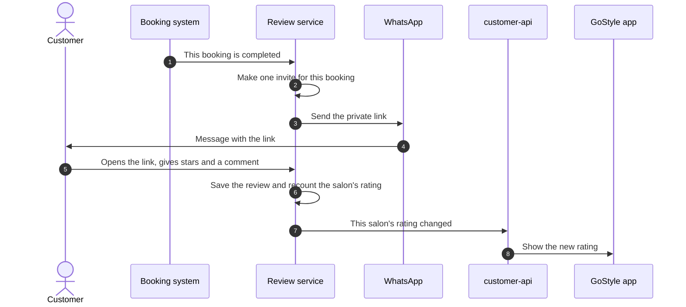
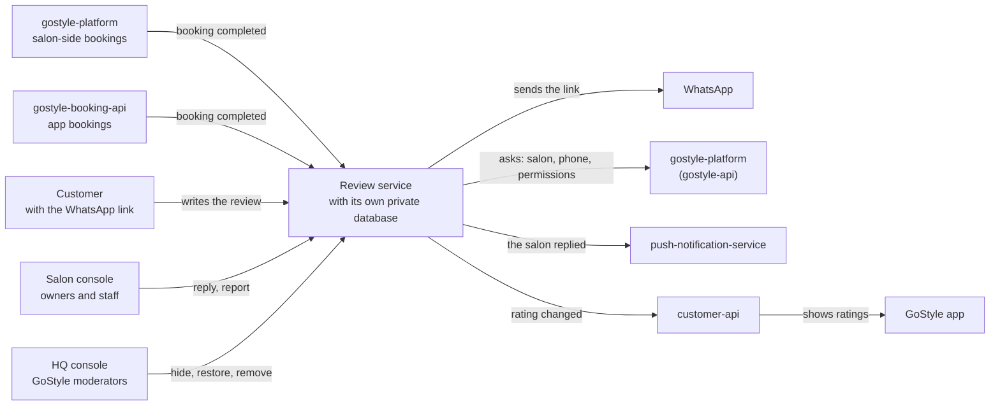
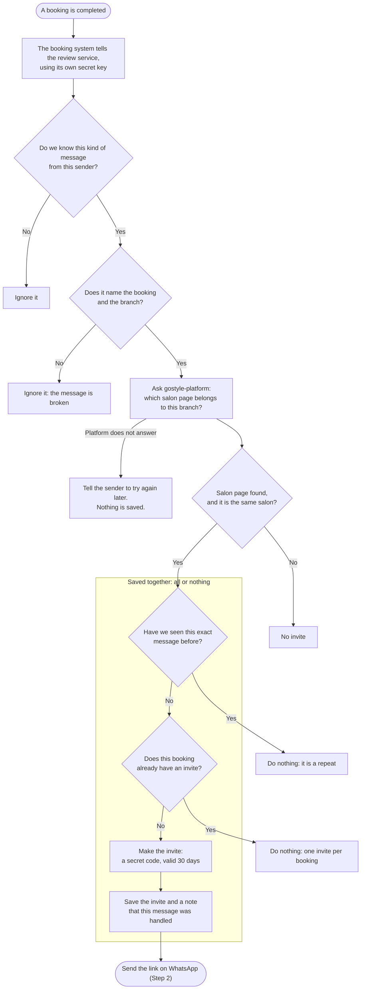
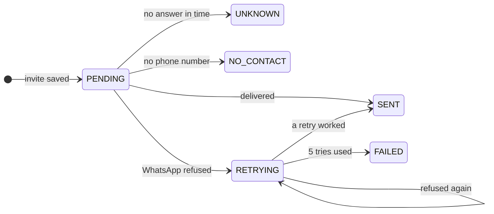
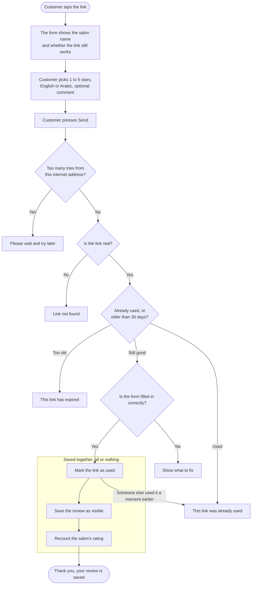
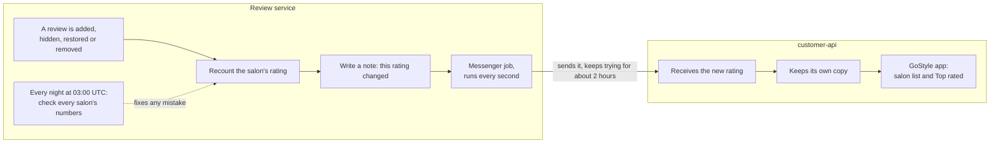
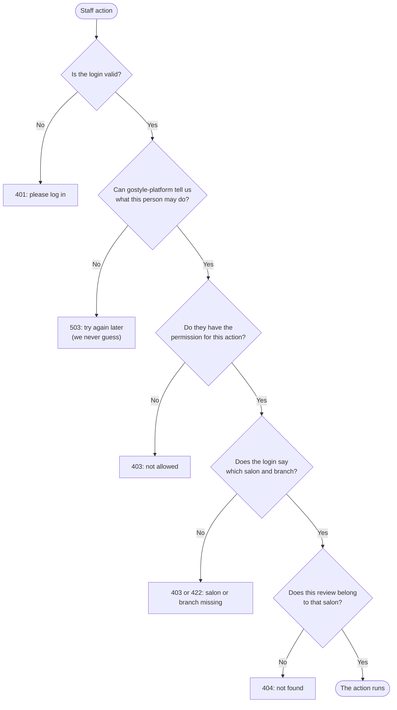
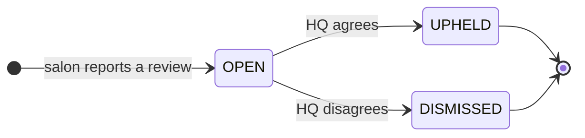
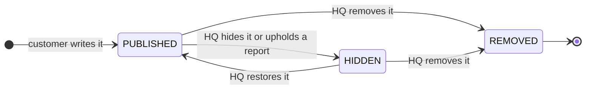

# How GoStyle Reviews Work

This document explains the review service in plain words: what it does, who
uses it, every step from a finished booking to a star rating in the app, and
why each step works the way it does.

You do not need to be technical to read sections 1 to 8. Section 9 is extra
detail for engineers.

**Contents**

1. [The short version](#1-the-short-version)
2. [The rules, and why we have them](#2-the-rules-and-why-we-have-them)
3. [Who and what is involved](#3-who-and-what-is-involved)
4. [The whole journey, step by step](#4-the-whole-journey-step-by-step)
5. [How we make sure nothing is lost or done twice](#5-how-we-make-sure-nothing-is-lost-or-done-twice)
6. [Keeping data safe](#6-keeping-data-safe)
7. [Questions people often ask](#7-questions-people-often-ask)
8. [Where the project stands today](#8-where-the-project-stands-today)
9. [For engineers](#9-for-engineers)
10. [Words used in this document](#10-words-used-in-this-document)

---

## 1. The short version

1. A customer finishes a booking at a salon.
2. The customer gets a WhatsApp message with a **private link**.
3. They tap the link and give the salon **1 to 5 stars**, with an optional comment.
4. The review appears on the salon's page, and the salon's **rating** in the
   GoStyle app updates within seconds.
5. The salon can **reply** to the review. If a review breaks the rules, the
   salon can **report** it, and GoStyle's HQ team decides what happens.

That is all a customer or a salon ever sees. The rest of this document explains
what happens behind each step.

---

## 2. The rules, and why we have them

| Rule | Why |
| --- | --- |
| Only a customer with a **completed booking** can review. | Stops fake reviews. You cannot review a salon you never visited. |
| **One review per booking**, forever. | One visit, one opinion. Even if HQ removes a review, that booking cannot be reviewed again. |
| The review link is **private, works once, and lasts 30 days**. | Only the person who got the message can use it, and an old link cannot be reused. |
| Stars are **whole numbers from 1 to 5**. | Simple and the same for everyone. |
| The comment is **optional**, up to **1000 characters**. | A quick star rating is still useful. Very long texts are hard to read. |
| A review is in **English or Arabic**. | The two languages the app supports. Ratings are also counted per language. |
| The reviewer's name comes from the **booking**. A blank name shows as **"Verified customer"**. | The name matches a real booking and cannot be faked. People with no name on the booking can still review. |
| One internet address can send at most **10 reviews an hour and 40 a day**. | Stops scripts from flooding the form. |
| A salon with no reviews shows **no rating**, not 0. | 0 stars would look like a terrible salon. |
| **Top rated** in the app means an average of **4.5 or more** from **at least 3 reviews**. | One lucky 5-star review is not enough to be called top rated. (This rule lives in customer-api.) |
| A salon **cannot hide or delete** reviews. It can **reply** or **report**. | Salons should not be able to remove honest criticism. A neutral HQ team decides. |

These rules were already used inside gostyle-platform. They were copied into
the review service unchanged, together with their tests.

---

## 3. Who and what is involved

### People

| Who | What they do | How we know who they are |
| --- | --- | --- |
| **Customer** | Opens the link and writes one review. | No login. The secret code inside the link is the permission. |
| **Salon staff** | See their own salon's reviews and rating, reply, report a review. | Their normal GoStyle login, plus the right permission for each action. |
| **HQ moderator** (GoStyle team) | Decides on reports. Can hide, restore or remove a review. | A GoStyle admin login with the moderation permission. |
| **Ops** (people running the service) | Run checks and watch for stuck messages. | A secret ops key. |

### Systems

| System | Role |
| --- | --- |
| **Review service** (this repo) | Owns everything about reviews: invites, reviews, replies, reports, ratings. |
| **gostyle-platform** | Where salon-side bookings happen. Tells us when a booking is completed. Also answers questions: which salon owns this branch, what is this customer's name and phone, what is this staff member allowed to do. |
| **gostyle-booking-api** | Where bookings made in the app happen. Tells us when a booking is completed. |
| **WhatsApp** | Delivers the message with the review link. |
| **push-notification-service** | Sends "The salon replied" to the customer's phone. |
| **customer-api** | Runs the app's salon list and the *Top rated* shelf. Keeps its own copy of every salon's rating. |

### The big picture

**One owner, one database.** Only the review service reads or writes review
data. Other systems never look inside its database. They send it messages,
or it sends them messages. This means the review data can never be changed
"from the side" by another system, and the review service can change how it
stores things without breaking anyone.

### Why a separate service at all?

Reviews used to live inside gostyle-platform. That caused real problems:

| Problem before | What the review service does |
| --- | --- |
| Bookings made in the app never got a review invite. | Both booking systems now send "booking completed" to the same place. |
| customer-api read the platform's review tables directly. Moving those tables would break the app. | customer-api gets rating updates as messages and keeps its own copy. |
| The rating was recounted from every review on every page load. | The rating is stored, updated with every change, and checked every night. |
| If the WhatsApp message failed, it was never tried again. That customer never got a link. | A failed message is tried again with a fresh link. |
| HQ could not restore or remove a review. | HQ can hide, restore and remove, always with a written reason. |

---

## 4. The whole journey, step by step

### Step 1: A completed booking becomes an invite

An **invite** is the permission to write one review for one booking. When a
booking is completed, the booking system sends a message to the review service.
The service checks the message and makes the invite.

**Why it works this way**

- **Nobody can ask for an invite.** Only a booking system, with its own secret
  key, can say "this booking is completed".
- **Booking systems sometimes send the same message twice** (for example, when
  the network was slow and they were not sure it arrived). We write down every
  message we handled, so the second copy does nothing.
- **One invite per booking, even after it expires.** Finishing the same booking
  again is not a way to message the customer again.
- **The salon is taken from the salon page's real owner**, never from the
  message. A message that names a different salon gets no invite.
- **"All or nothing"** means the invite and the note "this message was handled"
  are saved together. If anything fails half way, neither is saved, and the
  next try starts clean.

### Step 2: The link is sent on WhatsApp

Right after the invite is saved, the service asks gostyle-platform for the
customer's phone number and sends a WhatsApp message in English or Arabic. The
phone number is used once and never stored.

The invite remembers what happened to its message:

| Status | Meaning | What happens next |
| --- | --- | --- |
| `SENT` | WhatsApp accepted the message. | Nothing. It is never sent again. |
| `UNKNOWN` | WhatsApp did not answer in time. The message **may** have arrived. | Nothing. We never risk sending it twice. |
| `NO_CONTACT` | We have no phone number for this customer. | Nothing is sent. |
| `RETRYING` | WhatsApp clearly refused (it was down, or busy). | Try again with a **new** link after 1 minute, then 2, 4, 8 … (at most 1 hour apart). |
| `FAILED` | 5 tries were refused. | We stop. |

**Why it works this way**

- **Save first, send last.** The message only goes out after the invite is
  safely saved. A customer can never receive a link that does not exist.
- **If we are not sure, we do not resend.** Two messages for one visit would
  annoy the customer more than none.
- **A retry gets a new link.** We only keep a scrambled copy of the secret code
  (see [section 6](#6-keeping-data-safe)), so we cannot rebuild the old link.
  The old link never reached anyone, so replacing it is safe.
- **Before the switch-over**, the service runs in "log" mode: it writes "would
  send" in its log (with the phone number partly hidden) and sends nothing.

### Step 3: The customer writes the review

What the customer sees when something is wrong:

| Situation | Message code | In plain words |
| --- | --- | --- |
| Too many reviews sent from one address | `429` | Please wait and try again later. |
| The link does not exist | `404 INVITE_NOT_FOUND` | This link is not valid. |
| The link was already used | `409 INVITE_ALREADY_USED` | You already reviewed this visit. |
| The link is older than 30 days | `410 INVITE_EXPIRED` | This link has expired. |
| Stars missing, comment too long, and so on | `422 VALIDATION_FAILED` | Please fix the marked fields. |

**Why it works this way**

- **No login needed.** The customer only needs the link. Everything else (which
  salon, which booking, which customer) comes from the invite, not from what the
  browser says.
- **The link works once, checked three times.** First we give a clear answer
  (used, expired, not found). Then "mark as used" only works if nobody used it a
  moment earlier, so if the customer presses Send twice at the same moment, only
  one review is saved. Finally the database itself refuses a second review for
  the same booking.
- **All or nothing.** There is never a used link without a review, and never a
  review that the rating forgot to count.

### Step 4: The new rating reaches the app

The app's salon list and *Top rated* shelf come from customer-api, not from the
review service. So every time a salon's rating changes, the review service
sends the new numbers to customer-api.

**How the rating is calculated**

| Number | How | Example |
| --- | --- | --- |
| Average | Total stars ÷ number of reviews, rounded to 1 decimal. | 5 + 4 + 4 = 13 stars, 13 ÷ 3 = **4.3** |
| No reviews yet | No average at all (empty), never 0. | A new salon shows no rating. |
| Count | Number of reviews. | **3** |
| Star bars | How many 1, 2, 3, 4 and 5-star reviews. | 4 stars: **2**, 5 stars: **1**, the rest **0** |
| By language | How many in English and how many in Arabic. | English: **2**, Arabic: **1** |

Only **visible** (published) reviews count. Hidden and removed reviews are left
out of every number.

**Why it works this way**

- **The rating is stored, not recounted on every page view.** customer-api
  cannot look inside our database, so the numbers must be ready to send.
- **Recount, do not just add one.** When a review changes, the salon's rating
  is locked for a moment and recounted from the actual reviews. Even 20 reviews
  arriving at the same second end at exactly 20.
- **A nightly check** recounts every salon at 03:00 UTC and fixes any number
  that does not match. Ops can also run it at any time.
- **Each rating has a version number.** If an old update arrives late,
  customer-api keeps the newer one it already has.
- **The note is saved together with the review.** If customer-api is down, the
  note waits and the messenger keeps trying. Nothing is lost (see
  [section 5](#5-how-we-make-sure-nothing-is-lost-or-done-twice)).

### Step 5: The salon replies or reports

Salon staff work in the salon console. They only ever see **their own salon's**
reviews.

| Action | Rules | Permission needed |
| --- | --- | --- |
| See reviews | All reviews (visible, hidden, removed) with replies and reports, plus the rating. | `storefront-edit.read` |
| See the rating | Average, count, star bars, per language. | `storefront-edit.read` |
| Reply | One reply per review. It can be edited or deleted. | `marketing-reviews.update` |
| Report | Pick one of 5 reasons. Only one open report per review. The review **stays visible** until HQ decides. | `marketing-reviews.create` |

When the salon replies, the customer gets a phone notification: "The salon
replied". The notification has a fixed id per review, so even if it is sent
twice by mistake, the customer gets it only once.

Every staff action passes these checks, in this order:

**Why it works this way**

- **We ask gostyle-platform for permissions on each request** (and remember the
  answer for 30 seconds). The login itself does not carry them. If the platform
  cannot answer, we refuse. We never let someone in because we could not check.
- **Another salon's review answers "not found"**, not "not allowed". That way a
  guessed review id tells the person nothing.
- **Salons cannot hide or delete reviews.** They can answer in public or ask HQ
  to look at it.

### Step 6: HQ decides

Only GoStyle's HQ team can take a review off the public page. Every HQ action
needs a **written reason** of 10 to 500 characters, saved with who did it.

The 5 reasons a salon can report a review for:

1. Wrong branch or business
2. Off-topic or spam
3. Harassment
4. Promotes a competitor
5. Fake: the person never visited

**A report** moves like this:

- **UPHELD** (HQ agrees): the review is hidden.
- **DISMISSED** (HQ disagrees): the review stays exactly as it was.

**A review** moves like this:

| State | Shown on the page? | Counted in the rating? | Can it change? |
| --- | --- | --- | --- |
| `PUBLISHED` | Yes | Yes | Can be hidden or removed. |
| `HIDDEN` | No | No | Can be restored or removed. |
| `REMOVED` | No | No | **Never.** It is final. |

**Why it works this way**

- **Reporting never hides a review by itself.** Otherwise a salon could hide
  any bad review just by reporting it.
- **A removed review is kept in the database.** If it were deleted, that
  booking would be free for a second review, which is exactly the trick the
  "one review per booking" rule stops.
- **If two moderators decide the same report at the same moment**, one wins
  and the other is told it was already decided.

---

## 5. How we make sure nothing is lost or done twice

Messages between systems can arrive twice, arrive late, or get lost. A server
can stop in the middle of a step. Each risk has a guard:

| What could go wrong | What stops it |
| --- | --- |
| A booking system sends "completed" twice. | We note every message we handled. The repeat does nothing. |
| A customer gets two WhatsApp messages for one visit. | We send only after saving, never resend a sent message, and never resend when unsure. |
| WhatsApp is down and the customer never gets a link. | We try again with a new link, up to 5 times, waiting longer each time. |
| The customer presses Send twice. | "Mark as used" only works once. The database also refuses a second review for the same booking. |
| The link is used but the review is not saved. | Both are saved together, or neither. |
| A salon's rating becomes wrong. | It is recounted on every change, and every salon is checked every night. |
| customer-api is down when a rating changes. | The update is saved as a note together with the change. The messenger keeps trying for about 2 hours, then marks it as stuck so ops can see it. |
| An old rating arrives after a newer one. | customer-api keeps the highest version. |
| The "salon replied" notification is sent twice. | The notification service ignores a repeat with the same id. |

The "note" mentioned above is called the **outbox**: a table where outgoing
messages are saved in the same step as the change itself. A small background
job (the messenger) sends them and retries until they arrive. The list of
handled incoming messages is called the **inbox**.

---

## 6. Keeping data safe

- **The secret code in the link** is 32 random bytes. We store only a
  scrambled, one-way copy of it (a SHA-256 hash), never the code itself. Even
  someone who reads the database cannot rebuild a working link. The code is
  never written to logs, and logged web addresses have it replaced with
  `[token]`.
- **Phone numbers** are fetched when the message is sent and never stored. In
  logs they are partly hidden.
- **Each system has its own secret key** to talk to the review service. Keys
  must all be different, and at least 32 characters long in production. One
  key can be changed without touching the others.
- **Salons are kept apart.** A customer's review is tied to the salon of the
  booking. A staff member only sees their own salon's reviews, and the salon is
  never guessed or filled in by default.
- **The database and its job queue sit on a private network.** Only the review
  service itself can reach them.
- **Settings are checked when the service starts.** If anything is missing, it
  refuses to start and lists every missing setting at once (names only, never
  secret values).
- **The API documentation page** is switched off in production unless
  `SWAGGER_ENABLED=true` is set for a short testing window.

---

## 7. Questions people often ask

**Can someone write a fake review?**
It is very hard. They would need a completed booking and the private link sent
to that customer's phone. There is no way to ask for a link.

**Can a customer review the same visit twice?**
No. One booking, one review, forever.

**A customer had three bookings. How many reviews can they write?**
Up to three: one for each completed booking.

**Can a customer change or delete their review?**
Not today. Once sent, the review is final.

**The customer lost the link, or it expired. Can we send a new one?**
No. Each booking gets one invite, ever. The link stays in the customer's
WhatsApp chat for its 30 days.

**Can a salon delete a bad review?**
No. The salon can reply in public, or report it. Only HQ can hide or remove it.

**Does reporting a review hide it?**
No. It stays visible until HQ agrees with the report.

**Who can still see a hidden review?**
The salon in its console, and HQ. The public page and the rating leave it out.

**Why does a new salon show no rating instead of 0?**
Because 0 stars would look like a terrible salon. No reviews means no rating
yet.

**How fast does a new review change the rating in the app?**
Within seconds. The messenger job runs every second.

**What if the review service is down?**
The booking systems keep their "completed" messages and send them again later.
The app keeps showing the last known ratings, because customer-api has its own
copy. New reviews cannot be sent until the service is back.

**What if WhatsApp is down?**
We try again with a new link up to 5 times, waiting 1, 2, 4, 8 and 16 minutes
between tries. If WhatsApp did not answer at all (a timeout), we do not try
again, because the message may already have arrived.

**Do customers who booked in the app get the review link?**
Not yet. See [Known gaps](#known-gaps).

---

## 8. Where the project stands today

The review service is **built and tested, but not live yet.** gostyle-platform
still handles every real review today. The changes in the other three systems
are ready on separate branches, and every new switch is **off** by default.

| Phase | What | Status |
| --- | --- | --- |
| P1 | Skeleton: project, database setup, settings, health check, Docker | Done |
| P2 | Business rules, copied from the platform with their tests | Done |
| P3 | Saving data: tables, actions, outbox, database safety tests | Done |
| P4 | Reading data: ratings, nightly check, all web routes | Done |
| P5 | Connecting: booking messages in; WhatsApp, notifications, customer-api out | Done |
| P6 | Moving over: copy old reviews, run side by side, switch | Not started |
| P7 | Clean up: remove the old review code and tables from the platform | Not started |

### The switches that move real traffic

| System | Setting | Today | When switched on |
| --- | --- | --- | --- |
| gostyle-platform | `REVIEW_SERVICE_FORWARD_ENABLED` | off | Sends "booking completed" to the review service. |
| gostyle-platform | `REVIEW_SERVICE_INTERNAL_ENABLED` | off | Answers the review service's questions (salon, phone). |
| gostyle-booking-api | `REVIEW_SERVICE_FORWARD_ENABLED` | off | Sends "booking completed" to the review service. |
| customer-api | `REVIEW_RATINGS_SOURCE` | `platform` | With `review_service`, the app shows ratings from the review service. |
| review-service | `INVITE_SENDER` | `log` | With `whatsapp`, real messages are sent. |

### How the move will happen (P6), in short

1. **Prepare.** Merge the three branches (nothing changes, all switches are
   off). Create the secret keys. Start the review service in "log" mode.
2. **Copy.** Copy every old review, invite, reply and report from the platform,
   keeping the same ids, so old links keep working. Recount all ratings.
3. **Run side by side.** Turn on the booking messages. Customers still get
   only the platform's WhatsApp. Every day, compare invites and ratings in both
   systems until they always match.
4. **Switch,** in one deploy with a short pause on new reviews: copy the last
   changes, turn the platform's review code off, turn real WhatsApp sending on,
   point the consoles and the review form at the review service, and switch
   customer-api to the new ratings.
5. **Going back** is the same switches flipped back. Reviews written in the
   review service in the meantime must be copied back first.

The full checklist, with a check after every step, is in
[`BUILD_REPORT.md`](BUILD_REPORT.md) section 7.

### Known gaps

- **Customers who booked in the app get no WhatsApp link yet.** Their invite is
  made, but nobody has decided which system gives us their phone number, so it
  ends as `NO_CONTACT`. (Decision D14)
- **Customers who booked on the salon side get no "salon replied"
  notification yet.** There is no agreed way to match them to an app account.
  (D14)
- **If the service stops exactly between saving an invite and sending it,** the
  invite stays `PENDING` and is not sent automatically. The platform has the
  same gap today. (D22)
- **booking-api gives up after 10 tries (about 10 seconds).** If the review
  service is down longer while that switch is on, those messages must be reset
  by hand (checklist step 7). Sending them again is harmless.
- **The limit of 10 reviews an hour per internet address is counted per
  server.** That is exact with one server. Running more copies needs a shared
  counter first. (D17)
- **Nothing deletes old data yet.** The settings exist (expired invites after 90
  days, closed reports after 365), but the cleanup job comes in P7. (D18)
- **Erasing a customer's reviews** works as a command, but nothing triggers it
  yet, because no system sends a "customer deleted" message. (D25)
- **Planned for later:** rating individual stylists, and writing a review from
  inside the app while logged in.

---

## 9. For engineers

### All routes (21)

| Group | Method and path | Called by | Does |
| --- | --- | --- | --- |
| Public | `POST /v1/public/reviews/{token}` | review form | Write the review (10/hour, 40/day per IP). |
| Public | `GET /v1/public/review-invites/{token}` | review form | Salon name and `OPEN`, `USED` or `EXPIRED`. |
| Public | `GET /v1/public/storefronts/{storefrontId}/reviews` | app, web | Published reviews, newest first, with the reply. Paged, filter by language. |
| Console | `GET /v1/storefront/reviews` | salon staff | Every state, with reply, reports and the rating. |
| Console | `GET /v1/storefront/reviews/aggregate` | salon staff | The salon's rating. |
| Console | `POST /v1/storefront/reviews/{reviewId}/reply` | salon staff | Post the one reply. |
| Console | `PATCH /v1/storefront/reviews/{reviewId}/reply` | salon staff | Edit the reply. |
| Console | `DELETE /v1/storefront/reviews/{reviewId}/reply` | salon staff | Delete the reply. |
| Console | `POST /v1/storefront/reviews/{reviewId}/report` | salon staff | Report to HQ. |
| HQ | `GET /v1/platform/review-reports` | moderators | The report queue. |
| HQ | `GET /v1/platform/review-reports/{id}` | moderators | One report with its review. |
| HQ | `POST /v1/platform/review-reports/{id}/uphold` | moderators | Accept; hides the review. |
| HQ | `POST /v1/platform/review-reports/{id}/dismiss` | moderators | Reject. |
| HQ | `POST /v1/platform/reviews/{id}/hide` | moderators | Hide. |
| HQ | `POST /v1/platform/reviews/{id}/restore` | moderators | Restore. |
| HQ | `POST /v1/platform/reviews/{id}/remove` | moderators | Remove for good. |
| Internal | `POST /internal/events` | platform, booking-api | "Booking completed". |
| Internal | `GET /internal/ratings` | customer-api, ops | All rating summaries, for backfill and repair. |
| Internal | `POST /internal/ratings/recompute` | ops | Run the nightly check now. |
| Internal | `GET /internal/outbox` | ops | Pending and stuck messages. |
| Health | `GET /health` | Docker, monitoring | 200 when the database and Redis answer. |

- **Console** routes need the platform JWT plus the permission code listed in
  [Step 5](#step-5-the-salon-replies-or-reports).
- **HQ** routes need a `platform_admin` JWT plus `storefront.review_moderation`.
- **Internal** routes need the caller's own key in `x-service-key`.
- The console and HQ paths are the ones the front ends already call on
  gostyle-api, so at switch-over they only change their base URL.
- There is no public rating route. The app reads ratings from customer-api
  (D28).

### Messages (events)

| Event | Sent when | Who receives it |
| --- | --- | --- |
| `review.invite.created.v1` | An invite is made | Nobody yet (kept as a record) |
| `review.submitted.v1` | A review is written | Nobody yet |
| `review.hidden.v1`, `review.restored.v1`, `review.removed.v1` | HQ changes a review | Nobody yet |
| `review.reply.posted.v1` | The salon replies | push-notification-service |
| `review.reply.edited.v1`, `review.reply.deleted.v1` | The reply changes | Nobody yet |
| `review.report.filed.v1`, `.upheld.v1`, `.dismissed.v1` | A report changes | Nobody yet |
| `rating.summary.changed.v1` | A salon's rating changes | customer-api |

Incoming: `bookings.booking.completed.v1` from gostyle-platform and
`booking.completed` from gostyle-booking-api, both to `POST /internal/events`.

### Database tables

| Table | Holds | The database itself enforces |
| --- | --- | --- |
| `review` | Stars, comment, language, name, state, salon, booking | One per (booking system, booking id). Stars 1 to 5. Comment and name length. |
| `review_reply` | The salon's reply | At most one per review. |
| `review_invite` | Hashed code, expiry, used time, send status, salon name | One per booking. The hash must look like SHA-256. |
| `review_report` | Reason, note, status, who filed and who decided | One open report per review. |
| `rating_summary` | Per salon page: count, star sum, star bars, per language, version | The numbers must add up. |
| `outbox_event` | Messages waiting to be sent | |
| `inbox_event` | Messages already handled | One per (sender, message id). |

`yarn proof` runs 23 SQL tests that try to break these rules directly in the
database and confirm the database refuses each one.

### Where things are in the code

| What | Where |
| --- | --- |
| Settings (the only place that reads the environment) | `src/shared/config/app-config.ts` |
| Web routes | `src/review/presentation/*.controller.ts` |
| Business rules (no framework or database code) | `src/review/domain/` |
| Making invites | `src/review/application/commands/create-review-invite/` |
| Receiving "booking completed" | `src/review/application/consumers/booking-completed.consumer.ts` |
| Sending the WhatsApp link and retries | `src/review/application/invites/invite-delivery.ts` |
| Writing a review | `src/review/application/commands/submit-review/` |
| Recounting the rating | `src/review/application/rating/rating-projector.ts` |
| Outbox and the messenger job | `src/shared/outbox/` |
| Scheduled jobs (nightly check, resends) | `src/review/application/jobs/review-jobs.ts` |
| Login and key checks | `src/shared/auth/` |
| Database schema and migrations | `prisma/schema.prisma`, `prisma/migrations/` |
| Tests | `test/unit/`, `test/db/`, `test/e2e/`, `scripts/proof.sql` |

### Other documents

- [`README.md`](../README.md): how to run it locally, and all commands.
- [`DECISIONS.md`](DECISIONS.md): every choice made while building it (D1 to D28),
  with the reason and how to change it.
- [`BUILD_REPORT.md`](BUILD_REPORT.md): what was built and tested in P1 to P5,
  and the step-by-step P6 checklist.
- [`PLAN.html`](PLAN.html): the original plan.

---

## 10. Words used in this document

| Word | Meaning |
| --- | --- |
| **Tenant** | A salon business, with one owner account. It can have several branches. |
| **Branch** | One salon location. |
| **Salon page** (storefront) | A branch's public page in the app. One per branch. Ratings are kept per salon page. |
| **Booking system** | Where a booking was made: gostyle-platform (salon side) or gostyle-booking-api (the app). |
| **Invite** | The permission to write one review for one booking. Sent as a link. |
| **Token** | The secret code inside the link. |
| **Hash** | A scrambled, one-way copy of the token. It can check a token but cannot be turned back into one. |
| **Rating summary** | The stored numbers for one salon page: count, star total, star bars, per language. |
| **Outbox** | Where outgoing messages are saved together with the change, until a background job delivers them. |
| **Inbox** | The list of incoming messages already handled, so a repeat does nothing. |
| **Transaction** ("all or nothing") | A group of database changes that are saved together, or not at all. |
| **HQ** | GoStyle's own moderation team. |
| **Service key** | A long secret one system sends to prove which system it is. |
| **JWT** | The login token a staff member's browser sends with each request. |
