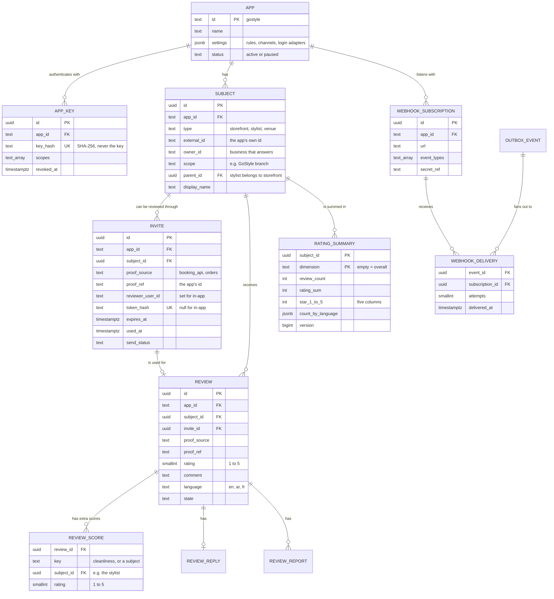
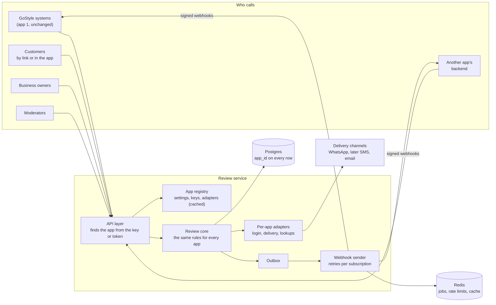
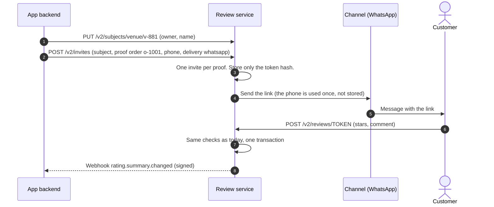
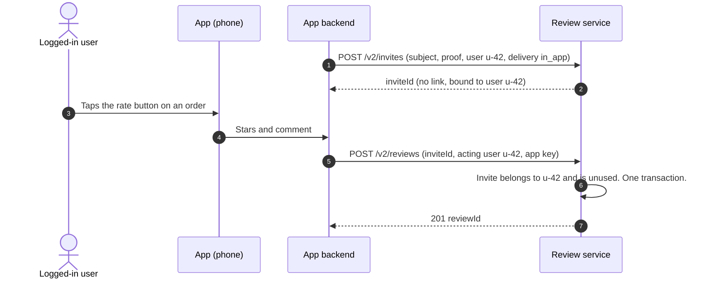
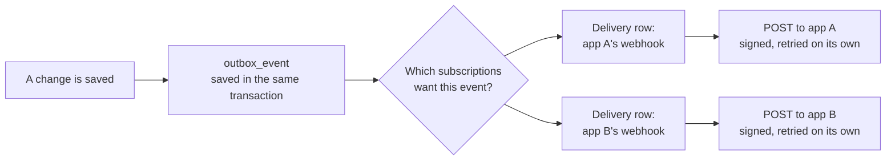

# Design: one review service for many apps

**Status:** proposal, nothing built yet. 9 Oct 2026.
**Question:** how do we change review-service so that other apps, not only
GoStyle salons, can store their own reviews and ratings in it?

Read [`HOW_IT_WORKS.md`](HOW_IT_WORKS.md) first if you do not know how the
service works today. Its section 9 is a short, plain-language version of this
design.

---

## 1. The answer in short

- Turn review-service into a **shared reviews and ratings service**. Any app
  can use it; GoStyle becomes the first app.
- Add three ideas to the model:
  - **App**: which product is using the service (GoStyle, or another app).
  - **Subject**: what is being rated (a salon, a stylist, a restaurant, a
    driver, a product, …).
  - **Proof**: why this person may write a review (a completed booking, a
    delivered order, a finished trip, …). One proof gives one review, the
    same as one booking gives one review today.
- **One database, with `app_id` on every row.** Every request is tied to one
  app by its key or token, and can never see another app's data.
- **The rules that stop fake reviews stay the same for every app.** Things that
  differ between apps (languages, comment length, report reasons, how the link
  is sent) become settings per app, not code.
- Apps connect in two ways: they **call the API** with their own app key, and
  they **receive webhooks** (signed messages) when something changes.
- **GoStyle's current API does not change.** The console, the review form,
  the booking systems and customer-api keep working as they are.
- **When:** change the database model **now, before P6** copies the platform's
  data in. Build the multi-app API and webhooks **when a second app is
  actually ready**. Section 10 explains why.

---

## 2. What another app needs

Two kinds of "other app" are covered by the same design:

| Kind | Example | What changes |
| --- | --- | --- |
| A new thing to rate inside GoStyle | Rating each stylist, not only the salon | A new subject type in the same app |
| A different product | A food app rating restaurants and riders; a sports app rating venues and coaches | A new app with its own subjects, rules, keys and webhooks |

### What every app must be able to do

1. Register, and get its own keys.
2. Say which subjects exist and who owns each one (the business that answers
   the reviews).
3. Give a customer the right to review, after a real event (the proof).
4. Let the customer write the review, either through a **link** (no login, like
   GoStyle today) or **inside the app** while logged in.
5. Read ratings and reviews, one subject at a time or many at once.
6. Let the business owner reply and report.
7. Moderate: hide, restore, remove, decide reports.
8. Get told when something changes (webhooks).

### What must stay true

- **No fake reviews.** A review needs a proof created by the app's own backend.
  Nobody can ask for one from outside.
- **Apps are walled off from each other.** App A can never read, change or
  even count app B's reviews.
- **One busy app cannot slow down the others.**
- **Adding an app is configuration, not a code change** (unless it needs a new
  kind of login or delivery channel).
- **GoStyle keeps working with no change** on its side.

---

## 3. What is GoStyle-only today

Most of the service is already generic. These parts are tied to GoStyle:

| Today | Problem for another app | Generic version |
| --- | --- | --- |
| `booking_source` enum (`platform`, `booking_api`) + `booking_id` (UUID) | Other apps have orders or trips, not bookings, and their ids may not be UUIDs | **Proof**: `proof_source` (text) + `proof_ref` (text), unique per app |
| `tenant_id`, `storefront_id`, `branch_id` on every row | Other apps have no salons or branches | **Subject** row: `(app, type, external id)`, with an `owner_id` and an optional `scope` |
| `rating_summary.subject_type` enum with only `STOREFRONT` | Any subject type must work | Summary keyed by the subject's internal id |
| `review_language` enum: EN, AR | Other apps use other languages | Language code as text; the allowed list is a setting per app |
| `count_en`, `count_ar` columns | Same | `count_by_language` as JSON |
| `review_report_reason` enum (salon reasons like `WRONG_BRANCH_OR_BUSINESS`) | Each app has its own reasons | Reason code as text; the allowed list is a setting per app |
| WhatsApp sender and gostyle-api phone lookup | Other apps have their own channels and contact data | Delivery per app: the app sends the link itself, or the service sends it through the app's channel |
| gostyle-api JWT + `/v1/auth/me` | Other apps have their own logins | A login adapter per app |
| Four fixed service keys in environment variables | Apps are added at runtime | App keys stored hashed in the database, with scopes |
| customer-api sink and push sink in code | Each app wants its own updates | Webhook subscriptions per app |
| `salon_name`, `storefront_slug` on the invite | Salon words | The subject's display name and link |

The domain rules (stars 1 to 5, single-use invite, one review per proof,
states, moderation) need **no change**.

---

## 4. The model



### The new ideas, in plain words

**App.** A product that uses the service. It has a short id (`gostyle`),
settings, keys and webhook addresses. Every other row belongs to exactly one
app.

**Subject.** Anything that can be rated. The app picks the `type` and gives its
own id (`external_id`). The service gives each subject its own internal id.
- `owner_id` is the business that answers reviews: a salon owner, a
  restaurant. Owners only see their own subjects.
- `scope` is an optional narrower group inside the owner. For GoStyle it is
  the branch, so a staff member who works at one branch sees that branch only.
- `parent_id` links a subject to a bigger one: a stylist to their salon.

**Proof.** The real event that earns the right to review: `proof_source` says
what kind of event, `proof_ref` is the app's id for it. `(app, proof_source,
proof_ref)` is unique on both the invite and the review. **One proof, one
review, ever.** That is today's rule, with "booking" replaced by "proof".

**Invite.** Kept, with the same name and the same rules. It now has two forms:
- a **link invite** has a secret token (only its hash is stored), exactly as
  today;
- an **in-app invite** has no token. It is bound to one logged-in user
  (`reviewer_user_id`) and only that user can use it.

**Review score.** Optional extra ratings in one review. Two uses:
- **dimensions**: "cleanliness 4, service 5" (keys set per app);
- **related subjects**: "the salon 5, the stylist 4". The stylist score counts
  toward the stylist's own rating. This is how stylist ratings, planned since
  the first plan, fit in.

**Rating summary.** The same stored numbers as today, per subject, plus one row
per dimension when the app uses dimensions. The stars stay as five columns, so
the database can keep checking that the numbers add up.

### Rules that are the same for every app

These protect trust in every rating, so no app can turn them off:

- Stars are whole numbers from 1 to 5.
- One review per proof, forever. A removed review keeps its proof used.
- An invite works once and expires.
- Only published reviews are shown and counted.
- The link token is stored only as a hash and never logged.
- The owner is never guessed or defaulted.
- Owners can reply and report, but cannot hide or delete.
- Every moderation action needs a written reason. REMOVED is final.

### Settings each app chooses

```json
{
  "id": "gostyle",
  "name": "GoStyle",
  "subjectTypes": ["storefront", "stylist"],
  "languages": ["en", "ar"],
  "commentMaxLength": 1000,
  "inviteValidDays": 30,
  "dimensions": [],
  "reviewerName": "from_invite_or_typed",
  "moderation": {
    "mode": "after_publish",
    "reportReasons": ["WRONG_BRANCH_OR_BUSINESS", "OFF_TOPIC_OR_SPAM", "HARASSMENT", "COMPETITOR_PROMOTION", "FAKE_NO_VISIT"],
    "moderators": "app"
  },
  "delivery": { "default": "whatsapp", "linkBaseUrl": "https://gostyle.app/review" },
  "login": { "users": "gostyle-jwt", "owners": "gostyle-auth-me" },
  "rateLimits": { "submitPerIpPerHour": 10, "submitPerIpPerDay": 40 }
}
```

| Setting | Choices | Default |
| --- | --- | --- |
| `subjectTypes` | Any list of names | (required) |
| `languages` | Language codes | `["en"]` |
| `commentMaxLength` | Up to 2000 | 1000 |
| `inviteValidDays` | 1 to 90 | 30 |
| `dimensions` | Extra score names, or none | none |
| `reviewerName` | From the invite, typed by the reviewer, or always anonymous | from the invite or typed |
| `moderation.mode` | `after_publish` (shown at once, like today) or `before_publish` (a new `PENDING` state, shown only after approval) | `after_publish` |
| `moderation.reportReasons` | Any list of codes | a general list |
| `moderation.moderators` | The app's own team, or the platform team | the app's own team |
| `delivery.default` | `none` (the app sends the link), `whatsapp`, later `sms` or `email` | `none` |
| `login.users`, `login.owners` | A login adapter (section 6) | the app's backend speaks for its users |
| `rateLimits` | Numbers | 10 an hour, 40 a day |

Settings are stored in the `app` row and cached. Secrets (WhatsApp tokens,
webhook signing secrets) are **not** stored in settings: settings only name
them, and the values live in Docker secrets or an encrypted column.

---

## 5. Architecture



**What each part does:**

- **API layer.** The first thing every request does is find its app: from the
  app key, from the user's login token, or from the invite token. From then on
  the app id comes only from there, never from the request body or the URL.
- **App registry.** Loads each app's settings, keys and adapters, and caches
  them in memory for a short time.
- **Review core.** Today's domain and handlers, almost unchanged. It now takes
  an app's settings as input (allowed languages, comment length, reasons).
- **Per-app adapters.** The parts that really differ per app, behind the ports
  the code already has: how users and owners log in, how the link is sent, how
  to look up a contact. GoStyle's current code becomes the `gostyle` adapters.
- **Outbox and webhook sender.** Today's outbox, plus one delivery row per
  subscription, so each app's webhook is retried on its own (section 8).

**The service stays one deployable**, one database and one Redis. Splitting it
up only makes sense much later, if one part grows very large.

---

## 6. How an app connects

### Pattern A: review by link (like GoStyle today)

For customers who are not logged in. The app's backend creates the invite; the
link is sent by the service or by the app.



If the app sends links itself (`delivery: none`), step 4 is skipped and the
response to step 2 contains the link **once**. The service never shows it
again. A repeat call for the same proof answers `already_invited` with no
link.

The review form can be the service's hosted form (with the app's name, logo
and link base from its settings) or the app's own form calling
`POST /v2/reviews/TOKEN`.

### Pattern B: review inside the app (logged-in users)



**Recommended default: the app's backend speaks for its users.** The app's
backend already knows who is logged in and what they may do, so it calls the
service with its app key and says which user it is acting for. The service
trusts the app key for that app's data only. Nothing new to set up.

**Option for apps that want their phones to call the service directly:** the
app registers a public key address (a JWKS URL) in its settings, and the
service checks the user's login token itself.

### Pattern C: showing ratings in the app

| Way | When to use |
| --- | --- |
| **Keep a copy from webhooks** (what customer-api does) | Lists, search, sorting, "top rated" shelves. The app can join ratings with its own data and never waits on the service. |
| **Read on demand** with `GET /v2/ratings?subjects=…` (up to 200 at once) | One page, one subject, small apps. Answers are cached by subject and version. |

### Owners and moderators

The same choice as Pattern B. By default the app's backend calls the owner and
moderation routes with its app key and says which owner (and scope) the user
works for. GoStyle keeps its current way: the staff member's own gostyle-api
token, with permissions checked through `/v1/auth/me`.

Moderators are **per app** by default: each app's team sees only its app's
reports. A **platform moderator** role can see every app, for a central team.

---

## 7. API (version 2)

Version 2 lives next to version 1. Version 1 stays exactly as it is for
GoStyle.

| Route | Who | What |
| --- | --- | --- |
| `PUT /v2/subjects/{type}/{externalId}` | app backend | Create or update a subject: owner, scope, parent, display name. |
| `POST /v2/invites` | app backend | Give the right to review: subject, proof, reviewer, delivery. Idempotent per proof. |
| `GET /v2/invites/{token}` | review form | Subject name and `OPEN`, `USED` or `EXPIRED`. |
| `POST /v2/reviews/{token}` | customer (link) | Write the review. Rate-limited per IP and per app. |
| `POST /v2/reviews` | app backend (in-app) | Write the review for a bound invite. |
| `GET /v2/subjects/{type}/{externalId}/reviews` | app | Published reviews, newest first, paged. |
| `GET /v2/subjects/{type}/{externalId}/rating` | app | One subject's rating. |
| `GET /v2/ratings?subjects=…` | app | Many ratings at once, or every rating page by page for a backfill. |
| `GET /v2/owner/reviews` | owner (via app) | All the owner's reviews, every state. |
| `POST`, `PATCH`, `DELETE /v2/owner/reviews/{id}/reply` | owner | One reply per review. |
| `POST /v2/owner/reviews/{id}/report` | owner | Report, with one of the app's reasons. |
| `GET /v2/moderation/reports`, `POST …/{id}/uphold`, `…/dismiss` | moderator | Decide reports. |
| `POST /v2/moderation/reviews/{id}/hide`, `…/restore`, `…/remove` | moderator | Change a review, with a reason. |
| `POST /v2/users/{userId}/erase` | app backend | Privacy: blank the user's name and id on all their reviews in this app. |
| `POST /v2/admin/apps`, keys, webhook subscriptions | platform admin | Register and manage apps. |

**App keys** are sent as `Authorization: Bearer <key>`. Each key has scopes
(for example `invites:write`, `ratings:read`, `owner:act`, `moderation:act`),
so an app can give its read-only parts a read-only key. An app can have two
active keys at once, so it can rotate keys without downtime.

### Example: create an invite

```http
POST /v2/invites
Authorization: Bearer rk_live_…

{
  "subject": { "type": "venue", "id": "v-881" },
  "proof": { "source": "orders", "ref": "o-1001" },
  "reviewer": { "userId": "u-42", "name": "Sara", "locale": "en" },
  "delivery": { "mode": "none" }
}
```

```json
{
  "outcome": "invite_minted",
  "inviteId": "0192f0c4-…",
  "link": "https://reviews.example.com/r/3q2X…",
  "expiresAt": "2026-11-08T10:15:00Z"
}
```

### Example: webhook

```http
POST https://app.example.com/hooks/reviews
x-review-signature: t=1791500000,v1=5f2c…

{
  "id": "0192f0c9-…",
  "type": "rating.summary.changed.v1",
  "appId": "foodapp",
  "occurredAt": "2026-10-09T10:15:02Z",
  "data": {
    "subject": { "type": "venue", "id": "v-881" },
    "reviewCount": 3,
    "ratingSum": 13,
    "average": 4.3,
    "histogram": { "1": 0, "2": 0, "3": 0, "4": 2, "5": 1 },
    "countByLanguage": { "en": 2, "ar": 1 },
    "version": "7"
  }
}
```

The signature is HMAC-SHA256 of `"<t>.<body>"` with the subscription's secret.
The receiver checks it, refuses a `t` older than 5 minutes, and ignores an `id`
it has already handled. Apps pick which event types they want. The event names
are the ones the service already uses (`review.submitted.v1`,
`review.reply.posted.v1`, `rating.summary.changed.v1`, …).

---

## 8. Keeping apps apart, safe and fast

### Walls between apps

1. **The app comes from the credentials only.** The app key, the user token or
   the invite token decides the app. A body or URL that names a different app
   is ignored.
2. **`app_id` is the first column of every unique key and index.** A query
   without it is slow and easy to spot in review. Repositories take the app as a
   required argument.
3. **Postgres row-level security as a second wall.** Each transaction sets
   `app.current_id`, and a policy on every table hides other apps' rows. A
   forgotten `WHERE app_id = …` then returns nothing instead of another app's
   data.
4. **Owners only see their own subjects**, and only their scope inside the
   owner, as GoStyle staff do today.
5. **Separate secrets per app**: keys, webhook secrets and channel tokens.
   Revoking one app touches nothing else.
6. **Option for very sensitive apps:** the registry can point one app at its own
   database. The code is the same; only the connection differs. Not the
   default, because it costs more to run.

### One app cannot slow the others

- **Rate limits per app and per IP, stored in Redis**, so they hold across
  several servers. (Today's limit is in memory, per server: decision D17.)
- **Webhooks retry per subscription.** One outbox event creates one delivery row
  per subscribed app. If app A's server is down, app A's deliveries wait and
  retry; app B still gets its webhooks on time.



- **Job limits per app.** Background work (sending links, webhooks) carries the
  app id, and each app has a cap on how many of its jobs run at once.
- **Metrics per app**: requests, errors, outbox lag, webhook failures, invites
  made versus used.

### Growing

- Reviews are written rarely and read often. Most reads go to the apps' own
  copies (webhooks) or a short cache, not to the database.
- Indexes start with `app_id`, so each app's queries stay fast however many
  apps there are.
- If one app becomes very large, its rows can be moved to their own Postgres
  partition (list partitioning by `app_id`) without changing the code.

---

## 9. Choices we did not make, and why

| Option | Why not (for now) |
| --- | --- |
| **Copy the service for each app** | Every fix and rule change done many times. No shared moderation or tools. Only worth it if the apps belong to different companies that must not share any system. |
| **A separate database for every app** | Strongest wall, but every migration, backup and alert done many times. Kept as an option for one sensitive app (section 8). |
| **Any rating scale per app** (1 to 10, thumbs up/down) | Averages from different scales cannot be compared or summed, and the database could no longer check the numbers. 1 to 5 stars is what most products use. Likes or thumbs are a different feature. |
| **Free-form JSON reviews** | The database could no longer enforce the anti-fraud rules (one per proof, stars 1 to 5). A small, size-limited `metadata` field per review is enough for app extras. |
| **Each app's events read by the service** (as GoStyle's "booking completed" today) | The service would need code for every app's event names. Apps call `POST /v2/invites` instead. GoStyle's event route stays as a GoStyle adapter. |

---

## 10. How to get there from today

### Why change the database now

review-db has **no live data yet**. P6 will copy every platform review, invite,
reply and report into it, and then real traffic starts. If the tables become
multi-app **before** that copy, the copy simply writes the new shape. If they
change **after** go-live, every table must be migrated with live traffic on it,
with more risk and probably a maintenance window.

The API work, on the other hand, is only useful when a second app exists.
Building it now would mean guessing that app's needs.

### Phases

| Phase | What | GoStyle sees | When |
| --- | --- | --- | --- |
| **0. Multi-app tables** | Section 11's schema changes, with GoStyle as app `gostyle`. Code uses app, subject and proof internally. v1 API unchanged. | Nothing | **Now, before P6** |
| P6 (as planned) | Backfill writes `app_id = 'gostyle'`, storefronts as subjects, bookings as proofs. The rest of the runbook is unchanged. | The planned move | After phase 0 |
| **1. App platform** | `app`, `app_key` and webhook tables in use; app registry; v2 API; webhook sender with per-subscription retries. customer-api's feed becomes a webhook subscription of `gostyle`. Redis rate limits. | Nothing | When a second app is agreed |
| **2. Second app** | Register it, set its settings, connect it with pattern A or B. Hosted form branding. | Nothing | With that app |
| **3. As needed** | Row-level security; stylist ratings and dimensions (review scores); `before_publish` moderation; SMS or email; own database for a sensitive app; partitioning. | Stylist ratings, if wanted | When there is a need |

---

## 11. Phase 0 in detail: the table changes

All changes are in review-service's own migrations, inside `review-db`, before
any live data exists.

| Table | Change |
| --- | --- |
| `app` (new) | `id text PK`, `name`, `settings jsonb`, `status`. Seed `gostyle` with today's rules. |
| `subject` (new) | `id uuid PK`, `app_id`, `type`, `external_id text`, `owner_id text`, `scope text`, `parent_id`, `display_name`, `slug`, `locale`. Unique `(app_id, type, external_id)`. GoStyle: `type = 'storefront'`, external id = storefront id, owner = tenant, scope = branch. |
| `review_invite` | Add `app_id`, `subject_id`. `booking_source` + `booking_id` become `proof_source text` + `proof_ref text`, unique `(app_id, proof_source, proof_ref)`. Add `reviewer_user_id`; `token_hash` becomes nullable (in-app invites). Salon name and slug move to `subject`. |
| `review` | Add `app_id`, `subject_id`. Proof columns as above, unique `(app_id, proof_source, proof_ref)`. `customer_id` becomes `reviewer_user_id text`. `language` becomes text (`'en'`, `'ar'`) with a format check. The tenant, storefront and branch columns are replaced by `subject_id` plus `owner_id` and `scope` copied from the subject, for fast owner queries. |
| `review_reply`, `review_report` | Add `app_id`. `reason` becomes text with a format check; the allowed list moves to the app's settings. |
| `rating_summary` | Key becomes `(subject_id, dimension)`, `dimension = ''` for the overall rating. `count_en`, `count_ar` become `count_by_language jsonb`. Star columns and the "numbers add up" check stay. |
| `outbox_event`, `inbox_event` | Add `app_id`. Inbox key becomes `(app_id, source, event_id)`. |
| Every table | `app_id` leads every unique key and index. |

**Code changes in phase 0** (the rules themselves do not change):

- `BookingRef` becomes `ProofRef (source, ref)`; `SubjectRef` points at a
  subject row; ids from apps become strings, not only UUIDs.
- `ReviewLanguage` and the report reason check the app's settings instead of a
  fixed list. The ported rule files keep their tests; only the list they check
  against moves.
- The GoStyle adapters (storefront lookup, contact lookup, WhatsApp, the
  gostyle-api login check) are registered for app `gostyle`.
- All v1 routes, the `/internal/*` routes and the event names stay the same.
  The e2e contract test proves it.
- The P6 backfill plan in `BUILD_REPORT.md` is updated to fill `app_id`,
  `subject` and the proof columns.

**Done when** every existing unit, DB and e2e test passes unchanged against the
new tables, the must-fail SQL proofs are updated to the new keys and still fail
as declared, and a new test shows two apps with the same proof id and the same
subject id stay fully separate.

---

## 12. Questions to answer before we start

1. **Who are the other apps?** Other GoStyle products, or apps of different
   companies? Different companies may need their own database (section 8, wall
   6).
2. **Who sends the review link?** Each app itself, or the service through
   WhatsApp, SMS or email? This decides how much channel work phase 1 needs.
3. **Does any app need reviews approved before they are shown?** That adds the
   `before_publish` mode and a `PENDING` state.
4. **Is 1 to 5 stars fine for every app?** The design assumes yes.
5. **Who moderates other apps' reviews?** Each app's own team, or GoStyle's HQ
   for everyone?
6. **Do we do phase 0 before P6?** It delays the move a little but avoids a
   live migration later. Recommended: yes, if a second app is likely.
