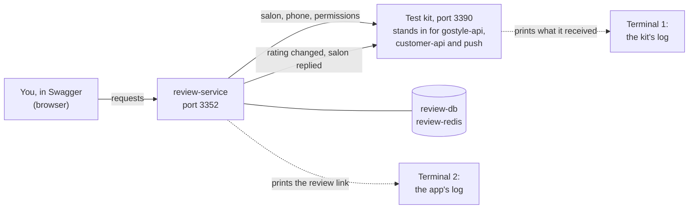
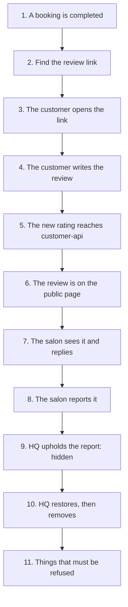

# How we test the review service

This guide shows how to check that the review service works: first the
automated tests, then the **complete flow by hand**, step by step, in Swagger,
from "a booking is completed" to "HQ removes the review".

You do not need to know the code. You need a terminal, a browser, and about
20 minutes. Every expected answer below was copied from a real run.

**Contents**

1. [Two ways we test](#1-two-ways-we-test)
2. [Automated tests](#2-automated-tests)
3. [Test the complete flow by hand](#3-test-the-complete-flow-by-hand)
   - [Step 0: Get ready](#step-0-get-ready)
   - [Step 1: A booking is completed](#step-1-a-booking-is-completed)
   - [Step 2: Find the review link](#step-2-find-the-review-link)
   - [Step 3: The customer opens the link](#step-3-the-customer-opens-the-link)
   - [Step 4: The customer writes the review](#step-4-the-customer-writes-the-review)
   - [Step 5: The new rating reaches customer-api](#step-5-the-new-rating-reaches-customer-api)
   - [Step 6: The review is on the public page](#step-6-the-review-is-on-the-public-page)
   - [Step 7: The salon sees it and replies](#step-7-the-salon-sees-it-and-replies)
   - [Step 8: The salon reports it](#step-8-the-salon-reports-it)
   - [Step 9: HQ upholds the report](#step-9-hq-upholds-the-report)
   - [Step 10: HQ restores, then removes](#step-10-hq-restores-then-removes)
   - [Step 11: Things that must be refused](#step-11-things-that-must-be-refused)
   - [Step 12: Finish](#step-12-finish)
4. [Checklist](#4-checklist)
5. [When something goes wrong](#5-when-something-goes-wrong)

---

## 1. Two ways we test

| | Automated tests | By hand |
| --- | --- | --- |
| **What** | Programs that check every rule, thousands of times faster than a person | A person walks through the real flow in Swagger |
| **When** | Before every push | Before a release, after a big change, or to learn how the service works |
| **Time** | About 2 minutes | About 20 minutes |
| **Finds** | Broken rules, race conditions, wrong error codes | Confusing answers, missing steps, config mistakes |

Both use your own machine only: the local `review-db` and `review-redis`
containers, never a shared server.

---

## 2. Automated tests

Run these from the project folder, in this order. The first three need nothing
running. The last three need Docker with `review-db` and `review-redis` up
(`docker compose up -d review-db review-redis`).

| Command | What it checks | Expected end of output |
| --- | --- | --- |
| `yarn typecheck` | The code compiles. | no output, no error |
| `yarn lint` | Common mistakes and style. | no output, no error |
| `yarn test` | **Unit tests.** Every business rule, the settings check, the senders, the error codes. No database. | `Tests  195 passed (195)` |
| `yarn test:db` | **Database tests** on a real Postgres: ten customers pressing Send at once make one review, twenty reviews at once end at exactly 20, a failed save leaves nothing behind. | `Tests  41 passed (41)` |
| `yarn test:e2e` | **End-to-end tests.** The real app over HTTP, with a stand-in for gostyle-api: every route, every error code, the whole flow in this guide, and 90 random reviews compared against an independent recount. | `Tests  44 passed (44)` |
| `yarn proof` | **Must-fail SQL.** 23 inserts that break a rule directly in the database (a second review for one booking, 6 stars, …). Each must be refused. | `23 tests, 23 as declared, 0 not` |

All four test suites must pass before a push. The database tests and the
end-to-end tests use their own database, `review_test`, which they empty as they
go. They never touch your development data.

---

## 3. Test the complete flow by hand

### How the test setup works

The review service talks to three other systems: gostyle-api, customer-api and
the push service. On your laptop, a small **test kit** stands in for all three,
so nothing else needs to run. The kit also prints ready-made logins.



Normally the review link only goes out by WhatsApp, and the service never
writes it anywhere. For testing, the app runs with `INVITE_SENDER=log_link`,
which prints the link in the app's log instead. **The service refuses to start
with `log_link` in production**, so a real customer's link can never end up in
a log.

The steps follow one review through its whole life:



### How to use Swagger

- **Authorize** (the lock button at the top). Paste a key into `service-key`, or
  a login token into `platform-jwt` (without the word "Bearer"). Press
  *Authorize*, then *Close*.
- **To switch** to another key or login: open *Authorize*, press *Logout* for
  that box, paste the new one, press *Authorize*.
- **To call a route:** open it, press *Try it out*, fill in the fields or the
  body, press *Execute*, and read **Server response** below.
- Public routes (the review form's routes) need no Authorize at all.

---

### Step 0: Get ready

You need Docker running, Node 22 and Yarn. From the project folder:

```bash
cp .env.example .env                          # only the first time
docker compose up -d review-db review-redis   # the database and Redis
docker compose stop review-app                # only if it is running: it uses port 3352
yarn install
yarn prisma generate
yarn prisma migrate deploy                    # "No pending migrations" is fine
```

**Terminal 1: start the test kit.**

```bash
yarn test-kit
```

It prints everything you need for the next steps: the command to start the app,
the Swagger address, the service keys, four login tokens, the demo salon's ids
and a "booking completed" event. Keep this terminal open: what the review
service sends to customer-api and the push service appears here. To see it all
again later, open <http://127.0.0.1:3390/kit> in the browser.

**Terminal 2: start the review service** with the command the kit printed:

```bash
PLATFORM_API_URL=http://127.0.0.1:3390 CUSTOMER_API_URL=http://127.0.0.1:3390 PUSH_API_URL=http://127.0.0.1:3390 INVITE_SENDER=log_link yarn start:dev
```

Wait for `Nest application successfully started`. Keep this terminal open too:
the review link appears here.

**Open Swagger:** <http://127.0.0.1:3352/docs>

The kit gives you these logins:

| Name | Who it is | Used in |
| --- | --- | --- |
| `staff` | A staff member of **Kit Test Salon**, allowed to read, reply and report | Steps 7, 8 |
| `staffReadOnly` | A staff member of Kit Test Salon who may only read | Step 11 |
| `otherSalonStaff` | A staff member of a different salon | Step 11 |
| `hq` | A GoStyle HQ moderator | Steps 9, 10 |

And these ids (they never change):

| What | Id |
| --- | --- |
| Kit Test Salon's storefront | `30000000-0000-4000-8000-000000000001` |
| Kit Test Salon's branch | `20000000-0000-4000-8000-000000000001` |
| The test customer (Sara Test, +971500000001) | `40000000-0000-4000-8000-000000000001` |

---

### Step 1: A booking is completed

**What happens in real life:** a customer's booking is marked completed in
gostyle-platform, and the platform tells the review service.

**In Swagger:**

1. *Authorize* → `service-key` → paste the **platform** key from the kit
   (in the example `.env` it is `change-me-platform-calls-review`).
2. Open **`POST /internal/events`** → *Try it out*.
3. Paste the event the kit printed as the body. It looks like this (your `id`
   and `aggregateId` are different):

   ```json
   {
     "id": "6f0c1d1e-3c2b-4a8e-9d55-0a1b2c3d4e5f",
     "type": "bookings.booking.completed.v1",
     "aggregateId": "b7e2f9a0-1234-4cde-8f00-112233445566",
     "payload": {
       "branchId": "20000000-0000-4000-8000-000000000001",
       "customerId": "40000000-0000-4000-8000-000000000001"
     }
   }
   ```

4. *Execute*.

**You should see:** `200`

```json
{ "outcome": "invite_minted", "sendStatus": "SENT" }
```

In terminal 1 (the kit), the service asked for the salon and the customer:

```
[gostyle-api] storefront for branch 20000000-0000-4000-8000-000000000001: Kit Test Salon
[gostyle-api] contact for customer 40000000-0000-4000-8000-000000000001: Sara Test
```

**Now press *Execute* again with the same body.** You should see:

```json
{ "outcome": "duplicate_event" }
```

**This proves:** a booking makes exactly one invite, and the same message sent
twice does nothing the second time.

> Need another booking later? Open <http://127.0.0.1:3390/kit/event> for a fresh
> event with new ids.

---

### Step 2: Find the review link

**What happens in real life:** the customer gets the link on WhatsApp.

**Here:** look in terminal 2 (the app) for a line like this:

```
INVITE_SENDER=log_link: review link for +97150*****01 (en): http://127.0.0.1:5173/review/2stBAPzJhKtU7KCdbshhU2gbX5lHIbRC1TrPUqWC9Fg
```

**Copy the part after `/review/`.** That is the **token**, the secret code in
the link. You need it in steps 3 and 4.

**This proves:** the link is made after the invite is saved, and the phone
number is masked even here.

---

### Step 3: The customer opens the link

**What happens in real life:** the review form loads and asks the service if
the link is still good.

**In Swagger:** open **`GET /v1/public/review-invites/{token}`** → *Try it out*
→ paste the token → *Execute*. (No Authorize needed.)

**You should see:** `200`

```json
{
  "status": "OPEN",
  "salonName": "Kit Test Salon",
  "storefrontId": "30000000-0000-4000-8000-000000000001",
  "expiresAt": "2026-11-08T10:00:50.905Z"
}
```

**This proves:** the form can show the salon's name, and the link lasts 30
days.

---

### Step 4: The customer writes the review

**In Swagger:** open **`POST /v1/public/reviews/{token}`** → *Try it out* →
paste the token → body:

```json
{ "rating": 5, "language": "EN", "comment": "Great haircut, friendly staff." }
```

*Execute*.

**You should see:** `201`

```json
{ "reviewId": "01a1201b-be63-7fa5-b204-4bfe4c58b195" }
```

**Copy the `reviewId`.** You need it in steps 7 to 11.

**Now press *Execute* again.** You should see `409`:

```json
{ "error": { "code": "INVITE_ALREADY_USED", "message": "INVITE_ALREADY_USED", "details": [] } }
```

**And run step 3 again.** The status is now `"USED"`.

**This proves:** a link works exactly once.

---

### Step 5: The new rating reaches customer-api

**What happens in real life:** within about a second, customer-api gets the
salon's new rating and the app shows it.

**Look in terminal 1 (the kit):**

```
[customer-api] rating.summary.changed.v1: storefront 30000000-0000-4000-8000-000000000001 now 1 review(s), average 5, version 1
```

**Also ask the service directly, as customer-api does:**

1. *Authorize* → `service-key` → *Logout* → paste the **customer-api** key
   (`change-me-customer-api-calls-review` in the example `.env`).
2. Open **`GET /internal/ratings`** → *Try it out* → `storefrontIds`:
   `30000000-0000-4000-8000-000000000001` → *Execute*.

**You should see:** `200`

```json
{
  "data": [
    {
      "storefrontId": "30000000-0000-4000-8000-000000000001",
      "reviewCount": 1,
      "ratingSum": 5,
      "average": 5,
      "histogram": { "1": 0, "2": 0, "3": 0, "4": 0, "5": 1 },
      "countByLanguage": { "EN": 1, "AR": 0 },
      "version": "1"
    }
  ],
  "nextCursor": null
}
```

(The real answer also has `tenantId`, `branchId` and `updatedAt`.)

**This proves:** the rating is counted and sent out with every change.

---

### Step 6: The review is on the public page

**In Swagger:** open **`GET /v1/public/storefronts/{storefrontId}/reviews`** →
`storefrontId`: `30000000-0000-4000-8000-000000000001` → *Execute*.

**You should see:** `200`, with your review:

```json
{
  "data": [
    {
      "id": "01a1201b-be63-7fa5-b204-4bfe4c58b195",
      "rating": 5,
      "comment": "Great haircut, friendly staff.",
      "language": "EN",
      "authorDisplayName": "Sara Test",
      "reply": null
    }
  ],
  "total": 1
}
```

**This proves:** the name comes from the booking (Sara Test), not from what the
customer typed.

---

### Step 7: The salon sees it and replies

1. *Authorize* → `platform-jwt` → paste the **`staff`** token.
2. **`GET /v1/storefront/reviews`** → *Execute*. You see the review with
   `"state": "PUBLISHED"`, `"reports": []` and the salon's rating in `summary`.
3. **`GET /v1/storefront/reviews/aggregate`** → *Execute*. You should see:

   ```json
   { "average": 5, "count": 1, "countByLanguage": { "EN": 1, "AR": 0 }, "histogram": { "1": 0, "2": 0, "3": 0, "4": 0, "5": 1 } }
   ```

4. **`POST /v1/storefront/reviews/{reviewId}/reply`** → your `reviewId` → body:

   ```json
   { "body": "Thank you Sara, see you soon!" }
   ```

   *Execute*. You should see `201` with the reply.

In terminal 2 (the app) you will see:

```
reply push for review 01a1201b-… skipped: no push user for this customer
```

That is **expected**: customers of salon-side bookings get no "salon replied"
notification yet (a known gap). Run step 6 again: the reply now shows under the
review.

**This proves:** staff see only their own salon, and can reply once.

---

### Step 8: The salon reports it

**In Swagger** (still as `staff`): **`POST /v1/storefront/reviews/{reviewId}/report`**
→ body:

```json
{ "reason": "OFF_TOPIC_OR_SPAM", "note": "Testing the report flow" }
```

**You should see:** `201`

```json
{ "reportId": "01a1201b-c982-702a-b8bd-1b40d34e7eb5", "reviewId": "01a1201b-…", "status": "OPEN", "reviewState": "PUBLISHED" }
```

**Copy the `reportId`.** Note `"reviewState": "PUBLISHED"`: run step 6 again and
the review is still on the public page.

**This proves:** reporting alone never hides a review.

---

### Step 9: HQ upholds the report

1. *Authorize* → `platform-jwt` → *Logout* → paste the **`hq`** token.
2. **`GET /v1/platform/review-reports`** → *Execute*. Your report is in the
   queue, with the salon's name and the review.
3. **`POST /v1/platform/review-reports/{id}/uphold`** → your `reportId` → body:

   ```json
   { "note": "Test: the comment is off-topic." }
   ```

**You should see:** `200`, with `"status": "UPHELD"` and `"reviewState": "HIDDEN"`.

In terminal 1 (the kit):

```
[customer-api] rating.summary.changed.v1: storefront 30000000-… now 0 review(s), average none, version 2
```

Run step 6 again: `"data": []`, `"total": 0`.

**This proves:** only HQ can take a review off the page, the rating drops at
once, and a salon with no visible reviews has **no** average (not 0).

---

### Step 10: HQ restores, then removes

Still as `hq`, with your `reviewId`:

| Do | Body | You should see | Kit shows |
| --- | --- | --- | --- |
| `POST /v1/platform/reviews/{id}/restore` | `{ "note": "Test: restoring after review." }` | `200`, `"state": "PUBLISHED"` | `now 1 review(s), average 5, version 3` |
| `POST /v1/platform/reviews/{id}/remove` | `{ "note": "Test: removing for good." }` | `200`, `"state": "REMOVED"` | `now 0 review(s), average none, version 4` |
| `POST /v1/platform/reviews/{id}/restore` again | `{ "note": "Test: this must be refused." }` | `409`, `REVIEW_TRANSITION_INVALID`: "A review that is REMOVED cannot be moved to PUBLISHED." | nothing |

**This proves:** hide and restore can go back and forth, removal is final, and
every change reaches customer-api in order (versions 1, 2, 3, 4).

---

### Step 11: Things that must be refused

Each line below must give exactly this answer. If one does not, stop and report
it.

| Try this | How | Must answer |
| --- | --- | --- |
| A wrong service key | `service-key` = `guess`, then `POST /internal/events` | `401` `SERVICE_KEY_INVALID` |
| The right key on the wrong route | `service-key` = platform key, then `GET /internal/ratings` | `403` `SERVICE_CALLER_FORBIDDEN` |
| A branch with no salon page | a body from <http://127.0.0.1:3390/kit/event?salon=unknown> to `POST /internal/events` | `200` `{"outcome":"no_storefront"}` (no invite) |
| A made-up link | `GET /v1/public/review-invites/not-a-real-token` | `404` `INVITE_NOT_FOUND` |
| 6 stars | a fresh invite (step 1 with a new event), then submit `{"rating": 6, "language": "EN"}` | `422` `VALIDATION_FAILED`, field `rating` |
| A language we do not support | same, with `{"rating": 4, "language": "FR"}` | `422` `VALIDATION_FAILED`, field `language` |
| The console with no login | *Logout* `platform-jwt`, then `GET /v1/storefront/reviews` | `401` `UNAUTHORIZED` |
| Staff without the reply permission | `platform-jwt` = `staffReadOnly`, then `POST …/{reviewId}/reply` | `403` `PERMISSION_DENIED` "Missing: marketing-reviews.update" |
| Another salon's review | `platform-jwt` = `otherSalonStaff`, then `DELETE …/{reviewId}/reply` | `404` `REVIEW_NOT_FOUND` |
| Staff on an HQ route | `platform-jwt` = `staff`, then `GET /v1/platform/review-reports` | `403` `PLATFORM_ACCESS_REQUIRED` |
| HQ without a real reason | `platform-jwt` = `hq`, then `POST /v1/platform/reviews/{id}/hide` with `{"note": "no"}` | `422` `VALIDATION_FAILED`, field `note` (10 characters minimum) |

---

### Step 12: Finish

Press `Ctrl+C` in both terminals.

The reviews you made stay in your **local development database** (`review` in
the `review-db` container). That is harmless. To start the next test from an
empty database, run this. **It empties every review table in your local
development database**, and nothing else:

```bash
docker exec review-service-review-db-1 psql -U review -d review -c \
  "TRUNCATE review_report, review_reply, review, review_invite, rating_summary, outbox_event, inbox_event"
```

---

## 4. Checklist

Tick each line before a release.

- [ ] `yarn typecheck`, `yarn lint`, `yarn test` pass
- [ ] `yarn test:db`, `yarn test:e2e`, `yarn proof` pass
- [ ] Step 1: a booking makes one invite; the same event again is `duplicate_event`
- [ ] Step 2: the link appears in the app's log, with the phone masked
- [ ] Step 3: the invite is `OPEN` with the salon's name
- [ ] Step 4: the review is saved once; a second submit is `409`; the invite is `USED`
- [ ] Step 5: customer-api receives the new rating within seconds
- [ ] Step 6: the review is on the public page with the booking's name
- [ ] Step 7: staff see the review and the rating, and can reply
- [ ] Step 8: a report keeps the review visible
- [ ] Step 9: upholding hides it, and the rating drops to no average
- [ ] Step 10: restore works, remove is final, versions arrive in order
- [ ] Step 11: every refusal gives exactly the listed answer

---

## 5. When something goes wrong

| You see | Why | Fix |
| --- | --- | --- |
| `503 DEPENDENCY_UNAVAILABLE` | The service cannot reach gostyle-api. | Is the kit running (terminal 1)? Did you start the app with the kit's command (it sets `PLATFORM_API_URL`)? |
| `401 SERVICE_KEY_INVALID` | Wrong key in *Authorize* → `service-key`. | Copy the key again from the kit. |
| `403 SERVICE_CALLER_FORBIDDEN` | The key is right, but that system may not use this route. | Use the key the step names (platform, customer-api or ops). |
| `401 UNAUTHORIZED` on the console or HQ | No login token, or it expired (they last 12 hours). | *Authorize* again; restart the kit for fresh tokens. |
| `403 PLATFORM_ACCESS_REQUIRED` | A salon login on an HQ route. | Use the `hq` token. |
| No link in the app's log | The app did not start with `INVITE_SENDER=log_link`, or the event was a repeat. | Restart the app with the kit's command; use a fresh event from <http://127.0.0.1:3390/kit/event>. |
| `{"outcome":"duplicate_event"}` on the first try | That event id was already used. | Use a fresh event. |
| `429 Too Many Requests` | More than 10 reviews in an hour from your machine. | Restart the app: the counter is in memory. |
| The app will not start: `INVITE_SENDER=log_link is not allowed in production` | `.env` says `NODE_ENV=production`. | Use `NODE_ENV=development` on your laptop. |
| `EADDRINUSE` on port 3352 | The `review-app` container is running. | `docker compose stop review-app` |
| `EADDRINUSE` on port 3390 | Another kit is running. | Close it, or start this one with `KIT_PORT=3395 yarn test-kit` and use the command it prints. |
